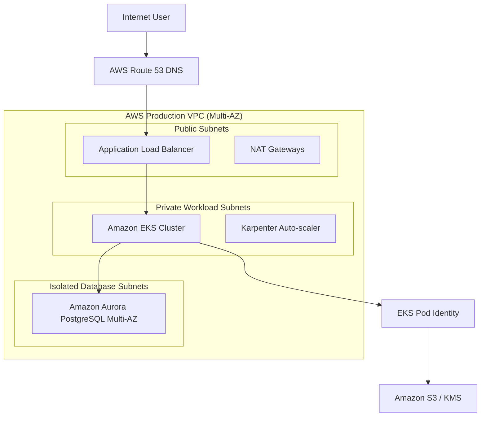

# How do you architect an end-to-end production DevOps project on AWS?

**Short answer:** Architect a production DevOps project on AWS by provisioning a Multi-AZ VPC using Terraform, deploying an Amazon EKS cluster with Karpenter autoscaling and EKS Pod Identity for keyless access, running Amazon Aurora PostgreSQL Multi-AZ for persistence, building CI/CD pipelines via GitHub Actions with OIDC, and routing traffic through ALB with Route 53 and CloudWatch/Prometheus telemetry.

## Detail

Designing an end-to-end production architecture on AWS requires combining IaC, secure identity, container orchestration, high availability, and automated delivery:

### 1. Network & Infrastructure Provisioning (Terraform)

- **VPC Architecture:** Multi-AZ (3 Availability Zones) containing public subnets (ALB / NAT Gateway), private workload subnets (EKS nodes), and isolated database subnets (Aurora DB).
- **Security Controls:** Network ACLs, Security Group least privilege, VPC Flow Logs sent to S3, and AWS KMS customer managed keys for encryption at rest.

### 2. Compute & Database Layer (EKS + Aurora)

- **Amazon EKS:** Managed Kubernetes control plane paired with Karpenter for just-in-time worker node provisioning.
- **Keyless Pod Authentication:** EKS Pod Identity maps Kubernetes ServiceAccounts directly to IAM Roles without static secrets.
- **Amazon Aurora PostgreSQL:** Multi-AZ DB cluster with automated storage scaling, encrypted snapshots, and RDS Proxy for connection pooling.

### 3. CI/CD & Security Pipeline (GitHub Actions + OIDC)

- **OIDC Authentication:** GitHub Actions assumes temporary IAM roles via AWS Security Token Service (STS).
- **Pipeline Stages:** Linting → Static Security (Gitleaks, Trivy) → Container Build → Amazon ECR Push → Helm chart release via Argo CD / Helm.

## Example

**1. High-Level AWS Production Architecture Diagram:**



**2. Terraform VPC & EKS Pod Identity Snippet (`main.tf`):**

```hcl
module "vpc" {
  source  = "terraform-aws-modules/vpc/aws"
  version = "~> 5.0"

  name = "production-vpc"
  cidr = "10.0.0.0/16"

  azs             = ["us-east-1a", "us-east-1b", "us-east-1c"]
  public_subnets  = ["10.0.1.0/24", "10.0.2.0/24", "10.0.3.0/24"]
  private_subnets = ["10.0.10.0/24", "10.0.20.0/24", "10.0.30.0/24"]
  database_subnets = ["10.0.100.0/24", "10.0.200.0/24", "10.0.300.0/24"]

  enable_nat_gateway   = true
  single_nat_gateway   = false
  enable_dns_hostnames = true
}

module "eks" {
  source  = "terraform-aws-modules/eks/aws"
  version = "~> 20.0"

  cluster_name    = "production-eks"
  cluster_version = "1.30"
  vpc_id          = module.vpc.vpc_id
  subnet_ids      = module.vpc.private_subnets

  enable_cluster_creator_admin_permissions = true
}
```

## Interview tips

- Always walk through the architecture layer by layer: **Networking** (VPC, Subnets, IGW/NAT) → **Compute** (EKS, Karpenter) → **Database** (Aurora Multi-AZ) → **CI/CD** (OIDC, ECR) → **Observability** (CloudWatch, Prometheus).
- Emphasize keyless identity: explain why using **EKS Pod Identity** or **IRSA** and **GitHub Actions OIDC** is superior to static IAM access keys.
- Address cost optimization: mention using Karpenter to schedule Spot Instances for stateless workloads while keeping Aurora and EKS control plane highly available.

<!-- BEGIN GENERATED RELATED TOPICS -->

## Related Concepts

- [[How do you troubleshoot a Pod stuck waiting for a PersistentVolumeClaim?]] (`#407`): [How do you troubleshoot a Pod stuck waiting for a PersistentVolumeClaim?](../kubernetes/how-do-you-troubleshoot-a-pod-stuck-waiting-for-a-persistentvolumeclaim.md)
- [[What is Cloud Computing?]] (`#21`): [What is Cloud Computing?](../cloud-platforms/what-is-cloud-computing.md)
- [[What is AWS (Amazon Web Services)?]] (`#22`): [What is AWS (Amazon Web Services)?](../cloud-platforms/what-is-aws-amazon-web-services.md)

<!-- END GENERATED RELATED TOPICS -->

---

[⬅ Back to AWS Engineering](./README.md) · [All topics](../README.md)
