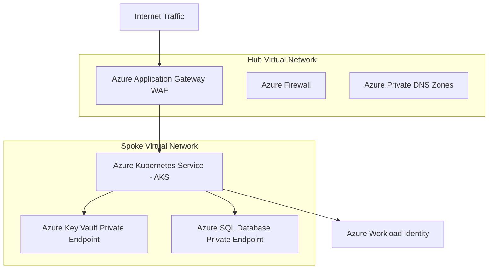

# How do you architect an end-to-end production DevOps project on Azure?

**Short answer:** Architect an end-to-end production DevOps project on Azure by provisioning a Hub-and-Spoke Virtual Network topology using Bicep/Terraform, deploying Azure Kubernetes Service (AKS) with Workload Identity and Entra ID RBAC, running Azure SQL Managed Instance over Private Endpoints, automating CI/CD via Azure DevOps Pipelines, and monitoring with Azure Monitor and Log Analytics.

## Detail

Designing a enterprise production environment on Microsoft Azure requires enforcing landing zone principles, strict network isolation, federated identity, and automated Bicep/Terraform deployments:

### 1. Enterprise Network Topology (Hub-and-Spoke VNet)

- **Hub VNet:** Houses centralized shared services, Azure Firewall / Application Gateway with WAF, Azure Bastion, and Azure Private DNS Zones.
- **Spoke VNet:** Hosts application workloads (AKS clusters, App Services) peered to the Hub VNet with forced tunneling through Azure Firewall.
- **Private Link / Endpoints:** All PaaS services (Azure SQL, Key Vault, Container Registry) expose internal IP addresses via Private Endpoints, disabling public endpoint access completely.

### 2. Compute & Security Architecture (AKS + Entra ID)

- **Azure Kubernetes Service (AKS):** Cluster deployed with Azure CNI Overlay networking, User-Assigned Managed Identity, and Entra ID (Azure AD) RBAC integration.
- **Azure Workload Identity:** Replaces legacy pod-managed identity to federate Kubernetes Service Accounts with Entra ID Managed Identities using OpenID Connect (OIDC).
- **Secrets Management:** Azure Key Vault storing certificates and connection strings, mounted into AKS pods via CSIDriver (Secrets Store CSI Driver).

### 3. CI/CD & Compliance Automation

- **Azure DevOps Pipelines / GitHub Actions:** Authenticates to Azure via OIDC Workload Identity Federation (eliminating service principal secret keys).
- **Azure Policy:** Enforces Enterprise Governance (e.g. denying public storage accounts, enforcing mandatory resource tagging, requiring encrypted disks).

## Example

**1. Azure Production Hub-and-Spoke Architecture Diagram:**



**2. Bicep Infrastructure Deployment Module Snippet (`main.bicep`):**

```bicep
param location string = resourceGroup().location
param clusterName string = 'prod-aks-cluster'

resource vnet 'Microsoft.Network/virtualNetworks@2023-05-01' = {
  name: 'spoke-vnet'
  location: location
  properties: {
    addressSpace: {
      addressPrefixes: [
        '10.1.0.0/16'
      ]
    }
    subnets: [
      {
        name: 'aks-subnet'
        properties: {
          addressPrefix: '10.1.0.0/22'
        }
      }
    ]
  }
}

resource aksCluster 'Microsoft.ContainerService/managedClusters@2023-10-01' = {
  name: clusterName
  location: location
  identity: {
    type: 'SystemAssigned'
  }
  properties: {
    dnsPrefix: 'prodaks'
    agentPoolProfiles: [
      {
        name: 'systempool'
        count: 3
        vmSize: 'Standard_D4s_v5'
        mode: 'System'
        vnetSubnetID: vnet.properties.subnets[0].id
      }
    ]
    securityProfile: {
      workloadIdentity: {
        enabled: true
      }
      oidcIssuerProfile: {
        enabled: true
      }
    }
  }
}
```

## Interview tips

- Highlight **Hub-and-Spoke topology**: explain how centralized Azure Firewall in the Hub VNet enforces egress traffic inspection across all Spoke VNets.
- Emphasize **Azure Workload Identity**: explain how it replaces static Azure Service Principal client secrets in CI/CD pipelines and AKS pods with OIDC federated tokens.
- Address PaaS isolation: always mention using **Azure Private Endpoints** and **Azure Private DNS Zones** to secure Azure Key Vault, ACR, and Azure SQL DB from public internet access.

<!-- BEGIN GENERATED RELATED TOPICS -->
## Related Concepts

- [[What is Cloud Computing?]] (`#21`): [What is Cloud Computing?](../cloud-platforms/what-is-cloud-computing.md)
- [[What is AWS (Amazon Web Services)?]] (`#22`): [What is AWS (Amazon Web Services)?](../cloud-platforms/what-is-aws-amazon-web-services.md)
- [[What is Azure?]] (`#23`): [What is Azure?](../cloud-platforms/what-is-azure.md)
<!-- END GENERATED RELATED TOPICS -->

---

[⬅ Back to Azure Engineering](./README.md) · [All topics](../README.md)
