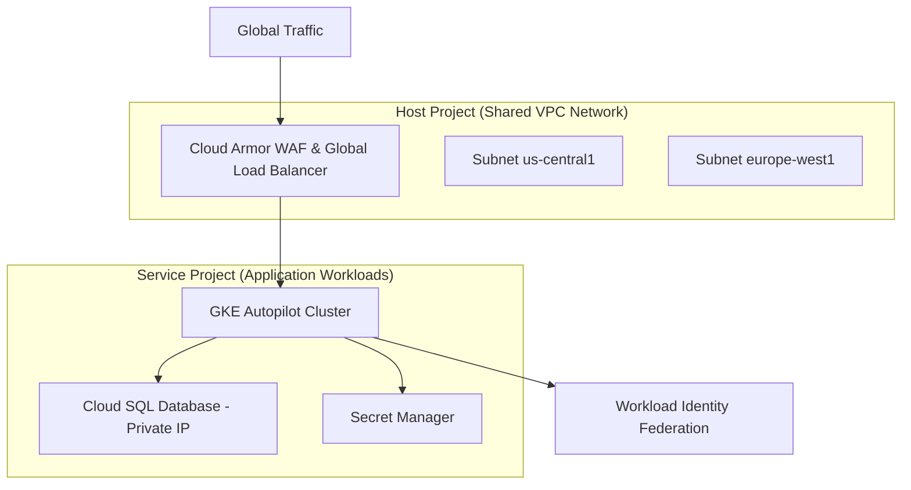

# How do you architect an end-to-end production DevOps project on GCP?

**Short answer:** Architect an end-to-end production DevOps project on GCP by building a Global VPC with Shared VPC networks, running GKE Autopilot with Workload Identity Federation (keyless IAM), provisioning Cloud SQL / Cloud Spanner via Terraform, automating pipelines with Cloud Build / GitHub Actions via Workload Identity, and monitoring with Google Cloud Operations Suite (Stackdriver).

## Detail

Google Cloud Platform's architecture differs fundamentally from other clouds due to its global network SDN backbone, keyless identity model, and managed GKE Autopilot capabilities:

### 1. Global Networking & VPC Architecture

- **Global VPC:** GCP VPCs are global resources spanning all GCP regions naturally.
- **Shared VPC Topology:** Host Project manages shared network subnets, Cloud NAT, Cloud Armor WAF, and Internal HTTP(S) Load Balancers, while Service Projects deploy isolated application workloads.
- **Private Google Access & VPC Service Controls:** Ensures GKE pods and Compute instances communicate with Google APIs (Cloud Storage, BigQuery) over internal Google private IP addresses, surrounded by VPC Service Controls perimeter boundaries.

### 2. Compute & Keyless IAM (GKE Autopilot + Workload Identity)

- **GKE Autopilot:** Production-ready managed Kubernetes where Google manages node provisioning, OS patching, control plane scaling, and security hardening automatically.
- **Workload Identity Federation:** Maps Kubernetes ServiceAccounts directly to GCP IAM Service Accounts without generating service account JSON key files (completely eliminating key leak risks).
- **Cloud SQL / Spanner Database:** Highly available relational data storage configured with Private IP only and Cloud SQL Auth Proxy for secure encrypted access.

### 3. CI/CD & Observability Infrastructure

- **Cloud Build / GitHub Actions:** Authenticated via GCP Workload Identity Federation pools for keyless build execution.
- **Artifact Registry:** Secure storage for container images and Helm charts with automated vulnerability scanning.
- **Google Cloud Operations Suite:** Integrated Prometheus metrics, Cloud Logging, and Cloud Trace for APM telemetry.

## Example

**1. GCP Global Production Architecture Diagram:**



**2. Terraform GCP GKE Autopilot & Workload Identity Module (`main.tf`):**

```hcl
resource "google_compute_network" "custom_vpc" {
  name                    = "prod-global-vpc"
  auto_create_subnetworks = false
}

resource "google_compute_subnetwork" "prod_subnet" {
  name          = "prod-us-central1-subnet"
  ip_cidr_range = "10.2.0.0/16"
  region        = "us-central1"
  network       = google_compute_network.custom_vpc.id

  secondary_ip_range {
    range_name    = "pod-ranges"
    ip_cidr_range = "10.100.0.0/16"
  }
  secondary_ip_range {
    range_name    = "service-ranges"
    ip_cidr_range = "10.200.0.0/20"
  }

  private_ip_google_access = true
}

resource "google_container_cluster" "primary" {
  name     = "prod-gke-autopilot"
  location = "us-central1"

  enable_autopilot = true
  network          = google_compute_network.custom_vpc.name
  subnetwork       = google_compute_subnetwork.prod_subnet.name

  ip_allocation_policy {
    cluster_secondary_range_name  = "pod-ranges"
    services_secondary_range_name = "service-ranges"
  }

  workload_identity_config {
    workload_pool = "${var.gcp_project_id}.svc.id.goog"
  }
}
```

## Interview tips

- Contrast **GCP Global VPC** with AWS/Azure regional VPCs: GCP subnets exist across multiple regions within the same VPC, simplifying multi-region mesh networking.
- Highlight **GCP Workload Identity Federation**: explain why downloading JSON service account keys is anti-pattern on GCP and how Workload Identity exchanges short-lived tokens.
- Emphasize **GKE Autopilot**: explain how Autopilot shifts node management, OS upgrades, and bin-packing responsibilities to Google SREs while enforcing strict security defaults out of the box.

---

[⬅ Back to GCP Engineering](./README.md) · [All topics](../README.md)
